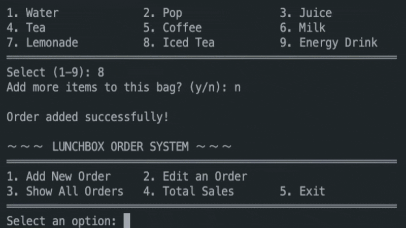

### 🍱 Project: Vibrant Impact Lunchbox Tracker
**A Multi-Item Order Tracker & Reward Game**

`*Figure 1: POS System Terminal Interface*`

### 🌟 Project Overview
Created as part of my Java development studies, this application simulates a professional Point of Sale (POS) system with a focus on clean UI in the console and robust Object-Oriented logic.

### ✨ Key Features
* **Nested Architecture:** A custom `Lunchbox` object managing a `String[]` collection of items.
* **Soft-Delete Logic:** Implemented `isCancelled` states to preserve data integrity instead of breaking array indices.
* **Terminal UX:** High-fidelity `printf` grid menus and double-border receipt generation.
* **Lucky Reward Logic:** Integrated `SecureRandom` to simulate a "Lucky Draw" for random snack prizes.

### 🛠️ Tech Stack
* **Language:** Java
* **Design Pattern:** Object-Oriented (Encapsulation & State Management)
* **Tools:** VS Code, Git/GitHub
